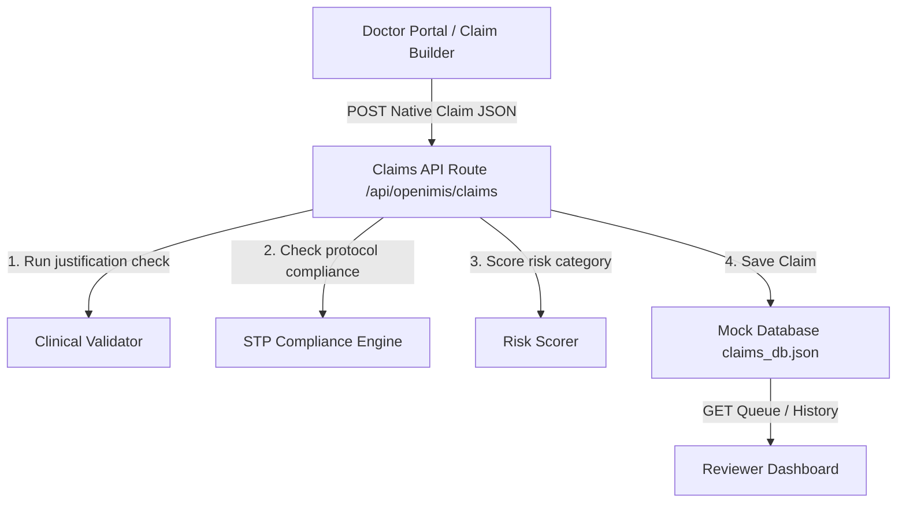

# ClaimSenseAI: Clinical Compliance & STP Validation
### Hackathon Project Submission Report

ClaimSenseAI is an AI-powered clinical compliance auditing and adjudication system designed to automate standard treatment protocol (STP) validations, verify medical justifications, and identify billing fraud, waste, and abuse (FWA) in real-time.

---

## 1. Problem Statement & Solution

### The Challenge
In modern healthcare systems (like Nepal's Health Insurance Board), claims auditing is a manual, labor-intensive process. Reviewers must manually cross-reference claims against voluminous Standard Treatment Protocols (STPs), drug capping guidelines, and age/gender contraindications. This leads to:
* High operational costs and adjudication delays.
* Increased leakage due to overlooked protocol deviations.
* Human error in verifying clinical justification of billed medications and tests.

### The Solution
**ClaimSenseAI** automates clinical justification auditing. It provides:
1. **At point-of-care (Doctor Portal)**: Real-time feedback to clinicians about protocol compliance and capping limits during claim construction, preventing administrative errors before submission.
2. **At adjudication (Reviewer Dashboard)**: A prioritized, risk-scored queue that flags specific clinical mismatches and protocol deviations, enabling fast-tracked approvals and transparent rejections.

---

## 2. Core Modules & Architecture

The application is built on a modern **Next.js & React** stack with a fast-performing, localized validation layer:

### A. Point-of-Care Claim Builder (`/doctor`)
Enables physicians to build claims with active diagnostic and billing checks:
* **Patient ID Autocomplete**: Autocomplete search suggestion list matching patient records (ID or name) from the database (`patientsDatabase.json`). Selecting a suggestion auto-fills Name, Age, and Gender.
* **Lock Demographics**: The Gender field is disabled (read-only) in the form, ensuring patient demographic profiles are derived strictly from database records.
* **Age Blur Persistence**: Direct editing of a patient's age in the form triggers a background `POST` request to the patients API upon input field blur (`onBlur`), ensuring updates are instantly saved in the database.
* **Autocomplete ICD Search**: Suggests matching ICD-11 codes (e.g., Malaria, Dengue, Type 2 Diabetes, Pneumonia) with matching percentages and pre-populates mandatory protocol tests/medications.
* **Custom Entry Validator**: Allows clinicians to add custom medications or procedures to verify how the auditing system handles compliance warnings.

### B. Validation & Compliance Engines (`src/lib/`)
* **Clinical Validator (`clinicalValidator.js`)**: Compares all billed medications, procedures, and tests in the care pathway against the **Clinical Dictionary** to ensure they are clinically justified for the listed diagnoses. Unapproved items trigger **Clinical Mismatch** warnings.
* **STP Compliance Engine (`stpEngine.js`)**: Evaluates the chronological pathway against standard clinical protocols. It currently enforces:
  * **Malaria Protocol**: Verifies prior diagnostic verification (RDT/Microscopy) before prescribing antimalarials. Enforces specific Chloroquine (Vivax) or AL/ACT (Falciparum) regimens.
  * **Contraindications**: Warns and applies penalties if Primaquine is prescribed to children under 6 months (`age < 0.5`) or pregnant/lactating women.
  * **Pneumonia Protocol**: Validates age-based antibiotics, flagging Doxycycline as contraindicated for children under 12 or pregnant women.
  * **Dengue Protocol**: Flags strictly contraindicated medications (like NSAIDs/Ibuprofen or steroids) due to bleeding risks.
* **Risk Scorer (`riskScorer.js`)**: Synthesizes clinical issues, protocol compliance scores, and polypharmacy guidelines to classify claims into **LOW, MEDIUM, or HIGH** risk tiers and calculate reviewer priority queues.

### C. Medical Reviewer Dashboard (`/reviewer`)
Streamlines the adjudication workflow for medical auditors:
* **Prioritized Queue**: Lists claims grouped by Active Queue (sorted oldest first) and History.
* **STP Adherence Score Card**: Displays a dedicated card with the compliance percentage and a green-to-emerald progress bar for the selected claim.
* **Deviation Timeline**: Provides a detailed timeline of all clinical mismatches and protocol deviations.
* **Scroll-Locked Actions**: The audit summary details scroll independently in a middle column, while the patient demographics header and the **Approve / Reject** buttons remain fixed at the bottom to ensure they are always visible and clickable.
* **Adjudication**: Approving or rejecting updates the claim status and saves reviewer comments back to the mock database.

---

## 3. Technology Stack & API Routes

| Layer | Technology / Implementation |
| :--- | :--- |
| **Frontend Framework** | React 19, Next.js (Turbopack) |
| **Styling** | Vanilla CSS with modern HSL color palettes and glassmorphism styling |
| **Data Storage** | Localized JSON file database storage (`claims_db.json`, `patientsDatabase.json`) |
| **API Route: Claims** | `/api/openimis/claims` (GET to fetch queue, POST to submit claims and audit, POST to adjudicate) |
| **API Route: Patients** | `/api/patients` (GET to fetch database list, POST to persist updated age on blur) |
| **API Route: ICD Search** | `/api/suggest-icd` (GET to query ICD database matching) |
| **API Route: Protocols** | `/api/protocols` (GET to fetch protocol guidelines) |

---

## 4. Key STP Verification Scenarios

### Scenario A: Malaria Guideline Violation (Vivax & Dosing Check)
* **Input**: A patient aged 45 is diagnosed with Vivax Malaria (`1F42`), but is prescribed Primaquine `2.5mg` (`MED-PQ-2.5`) instead of the standard `7.5mg` dose (`MED-PQ-7.5`), and Chloroquine `150mg`.
* **Engine Evaluation**:
  * Adherence Score: **45%** (reduced by `-30` incorrect dosing penalty and `-25` restricted medication referral deviation).
  * Risk Category: **MEDIUM RISK (38/100)**.
* **Result**: Dashboard flags the incorrect dosing and restricted medication deviations immediately, prompting the reviewer to reject.

### Scenario B: Dengue Contraindicated Medication
* **Input**: A patient diagnosed with Severe Dengue (`1D22`) is prescribed Paracetamol, ORS, and Ibuprofen (`MED-IBU-400`).
* **Engine Evaluation**:
  * Adherence Score: **30%** (reduced by `-50` for contraindicated NSAID prescription and `-20` for missing hospital referral).
  * Risk Category: **MEDIUM RISK (45/100)**.
* **Result**: Dashboard highlights the bleeding hazard contraindication, prompting a fast-tracked rejection.
