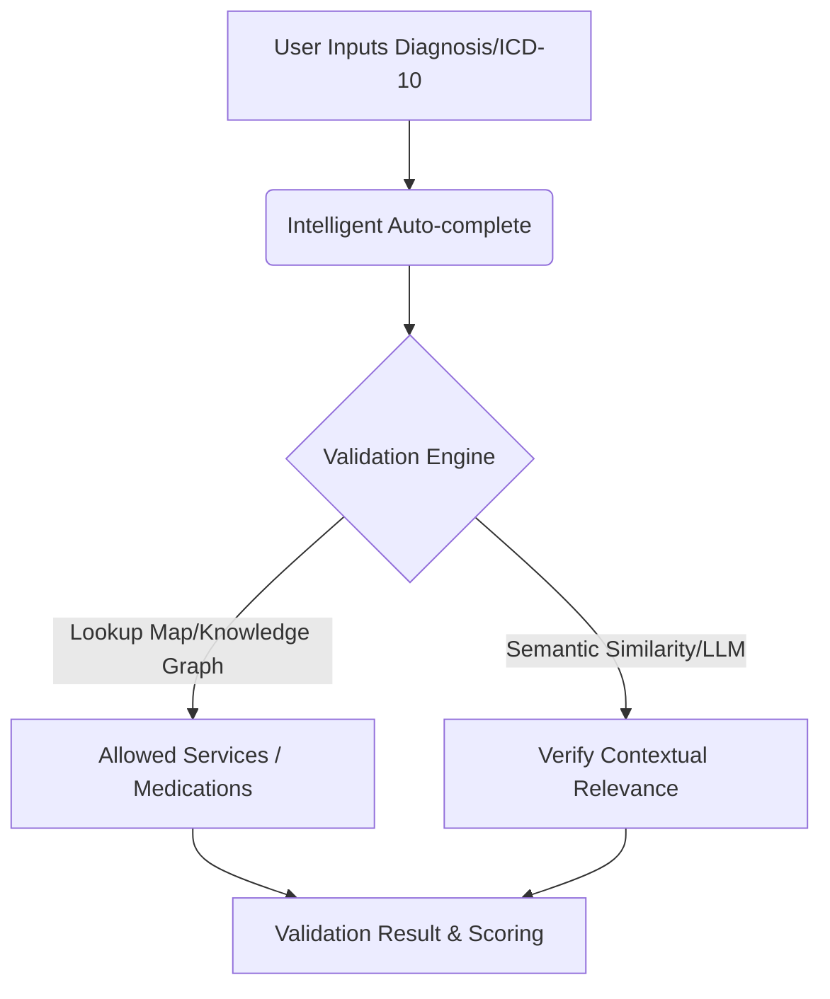
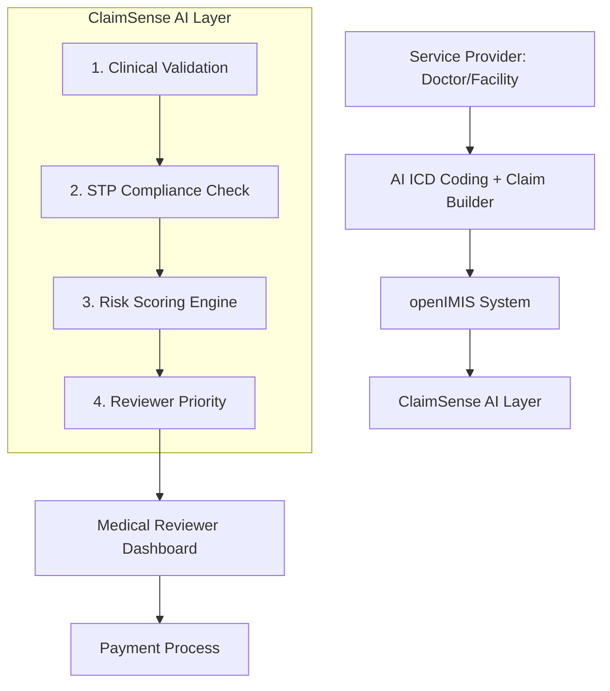
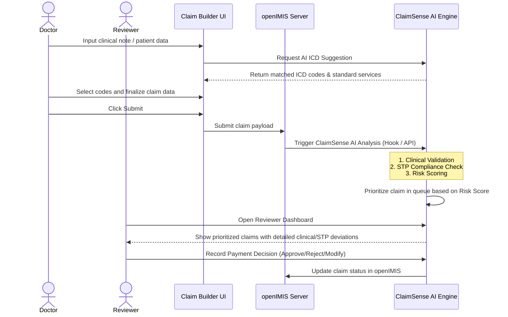

# Hackathon Track Study: Clinical Compliance & Standards Core

This document outlines the conceptual breakdown, data standards, architectural strategies, and implementation options for the **ClaimSenseAI** project under the **Clinical Compliance & Standards Core** track.

---

## 1. Track Overview & Objectives

The track is divided into two primary clinical validation pillars:
1. **Intelligent ICD-to-Service Mapping**: An autocomplete and validation module that cross-references diagnosis codes (ICD) with treatments, drugs, and services to catch billing and clinical errors before submission.
2. **Real-Time STP Compliance Checker**: A rule-based engine that compares care pathways (encounters, diagnostic tests, treatments) against Standard Treatment Protocols (STPs) to score clinical quality, identify deviations, and verify claim legitimacy.

---

## 2. Component 1: Intelligent ICD-to-Service Mapping

### A. The Challenge
Medical claims often contain mismatches where the billed service or prescribed drug does not align with the patient’s diagnosed condition (e.g., billing for an appendectomy when the diagnosis is acute tonsillitis, or prescribing an antihypertensive for a fracture). 

### B. Standard Vocabularies & Ontologies
To build an effective mapper, we must reference standardized systems:
*   **Diagnoses**: **ICD-10-CM** (Clinical Modification) or **ICD-11**.
*   **Medications**: **RxNorm** (US) or **ATC (Anatomical Therapeutic Chemical)** classification system.
*   **Procedures & Billed Services**: **CPT** (Current Procedural Terminology), **HCPCS** Level II, or **SNOMED-CT**.

### C. Technical Approaches for Mapping



1. **Rule-Based Mapping (Knowledge Graph / Relational Mapping)**:
   *   **Mechanism**: A predefined relational database or JSON mapping of ICD codes to eligible CPT codes and RxNorm ingredients.
   *   **Pros**: Deterministic, fast, 100% auditable.
   *   **Cons**: High maintenance; hard to cover all medical edge cases manually.
2. **Vector/Semantic Search (Clinical Embeddings)**:
   *   **Mechanism**: Convert diagnoses and services into high-dimensional vectors (using sentence-transformers trained on clinical text, like `BioBERT` or `ClinicalBERT`). Perform vector similarity search (using FAISS, pgvector, or a lightweight front-end library like `fuse.js` if the subset is small).
   *   **Pros**: Handles synonyms, typos, and fuzzy descriptions (e.g., "High blood pressure" matches "Essential hypertension" and suggests anti-hypertensive codes).
   *   **Cons**: Non-deterministic; requires threshold tuning.
3. **Hybrid Model (Recommended)**:
   *   Use **semantic search** for the autocomplete UI to help providers select the right codes quickly.
   *   Use a **rule-based validation engine** for the hard clinical restrictions (e.g., "Medication X is only approved for Diagnoses A, B, and C").

---

## 3. Component 2: Real-Time STP Compliance Checker

### A. The Challenge
A patient's care pathway consists of a series of actions over time: symptoms presentation $\rightarrow$ diagnostic tests $\rightarrow$ confirmed diagnosis $\rightarrow$ therapeutics/surgical intervention $\rightarrow$ follow-up. 
Standard Treatment Protocols (STPs) dictate the guidelines for these pathways. A compliance checker must evaluate this sequence in real-time.

### B. Modeling Care Pathways
A clinical pathway can be modeled using standard data formats:
*   **FHIR (Fast Healthcare Interoperability Resources)**: Utilizing `Condition`, `Observation`, `Procedure`, `MedicationRequest`, and `CarePlan` resources.
*   **Sequential Log / Graph**: A chronological array of events:
    ```json
    [
      { "timestamp": "2026-06-16T10:00:00Z", "type": "symptom", "value": "High Fever & Chills" },
      { "timestamp": "2026-06-16T10:15:00Z", "type": "test_ordered", "value": "Malaria RDT" },
      { "timestamp": "2026-06-16T10:45:00Z", "type": "test_result", "value": "P. falciparum Positive" },
      { "timestamp": "2026-06-16T11:00:00Z", "type": "prescription", "value": "Artemether-Lumefantrine" }
    ]
    ```

### C. Rule Engine Architecture
To check compliance dynamically, we need an engine to evaluate declarative rules.
*   **Rule Representation**: Rules can be written in JSON for portability:
    ```json
    {
      "protocol": "Malaria Treatment Protocol",
      "conditions": {
        "all": [
          { "fact": "diagnosis", "operator": "equal", "value": "Malaria" },
          { "fact": "diagnostic_test_performed", "operator": "equal", "value": true }
        ]
      },
      "event": {
        "type": "compliant",
        "params": { "message": "Standard diagnostic confirmation met before treatment." }
      }
    }
    ```
*   **Rule Engine Options**:
    *   **Node.js**: `json-rules-engine` (fast, declarative, runs on client or server).
    *   **Python**: `durable-rules` or simple custom AST evaluation.
    *   **Graph/State Machine**: Model protocols as a State Machine (e.g., using `XState` in TypeScript) where transitions represent allowed clinical steps. Deviations are triggered when invalid transitions are attempted.

### D. Scoring Methodology
The compliance checker should output a **Care Legitimacy Score** (e.g., 0 - 100).
*   **Formula Component**:
    $$\text{Legitimacy Score} = 100 - \sum (\text{Deviation Penalty} \times \text{Weight})$$
*   **Deviation Categories**:
    *   *Critical Deviation* (Weight: 40): Missing mandatory diagnostics (e.g., treating malaria without a positive test), prescribing contraindicated drugs.
    *   *Major Deviation* (Weight: 20): Sub-therapeutic dosage, incorrect sequencing (e.g., performing MRI before X-ray for standard joint pain).
    *   *Minor Deviation* (Weight: 5): Delayed administration, lack of routine follow-up checkups.

---

## 4. Potential Tech Stack for ClaimSenseAI

For a hackathon setting, a **TypeScript/Next.js/React** or **Python/FastAPI + React** stack offers the fastest development cycle, rich UI components, and easy state management.

| Layer | Recommended Tech | Rationale |
| :--- | :--- | :--- |
| **Frontend UI** | React (Next.js / Vite) + Tailwind CSS | Fast prototyping, excellent autocomplete components, interactive graphs for showing care pathway deviations. |
| **Data Visualization** | Mermaid.js / Recharts | To visualize the care pathway flowchart and highlight where the provider deviated from the STP. |
| **Backend API** | Python (FastAPI) or Node.js (Express) | Python is excellent if clinical NLP/embeddings are used. Node.js is great for single-language stacks. |
| **Database / Search** | SQLite / Postgres (with `pgvector`) | Structured queries for rules, vector capability for fuzzy ICD-to-service match. |
| **Rule Engine** | `json-rules-engine` (JS/TS) | Lightweight, easy to write/read protocols as JSON assets. |

---

## 5. Next Steps

*   **Align on Stack**: Choose between JS/TS fullstack vs. Python + React.
*   **Determine Data Scope**: Pick 3-5 standard clinical conditions (e.g., Hypertension, Malaria, Type 2 Diabetes, Acute Appendicitis) to model fully for the demo.
*   **Acquire Datasets**: Prepare mock ICD-10 codes, medication names, CPT codes, and STP rule files.

---

## 6. System Architecture & Integration

Based on your system plan, the claim lifecycle flows as follows:



### Key Architectural Integrations
1. **openIMIS Integration**: 
   * openIMIS is an open-source Insurance Management Information System. We will need to interface with openIMIS claim data structures (either via webhooks, REST APIs, or database triggers).
2. **ClaimSense AI Layer Functions**:
   * **Clinical Validation**: ICD-to-service mapping and dosage/contraindication checks.
   * **STP Compliance Check**: Evaluating sequence of care against national Standard Treatment Protocols.
   * **Risk Scoring Engine**: Assessing probability of fraud, waste, or abuse (FWA) based on clinical and billing patterns.
   * **Reviewer Priority**: Routing high-risk or high-deviation claims to the top of the Medical Reviewer's queue to optimize manual review time.
3. **Medical Reviewer Dashboard**:
   * A targeted workspace for claim reviewers showing validation details, highlighted STP deviations, risk scores, and reasons for prioritization.

---

## 7. End-to-End Claim Workflow

Here is the sequential user and data workflow that we will implement:



### Detailed Steps:
1. **Doctor Note Input**: The doctor inputs structured and/or unstructured notes about the patient's presentation.
2. **AI ICD Suggestion**: The system parses the note (or uses structured inputs) to suggest appropriate ICD codes and clinical services.
3. **Claim Builder**: The provider completes the claim details, confirming the proposed diagnoses, medications, procedures, and costs.
4. **Submit to openIMIS**: The claim is sent to openIMIS.
5. **ClaimSense AI Analysis**: The submission triggers analysis by our ClaimSense AI engine.
6. **Clinical Validation**: Verifies code/service compatibility, drug dosages, and contraindications.
7. **STP Compliance Check**: Checks clinical actions against guidelines, scoring the clinical care quality.
8. **Risk Scoring**: Evaluates the probability of claims anomalies or non-compliance.
9. **Reviewer Dashboard**: A dashboard that displays flags, clinical graphs, deviations, and prioritization scores.
10. **Payment Decision**: The reviewer adjudicates the claim, syncing the status back.

---

## 8. Finalized Hackathon Scope Decisions

Based on alignment, we have finalized the following scoping decisions:
*   **openIMIS Integration**: We will use a **Mock/Simulated openIMIS API** approach. This will involve exposing API endpoints (e.g., webhook receiver) that mirror realistic openIMIS schemas.
*   **Clinical Conditions**: We will focus on **3 to 4 clinical conditions** to model rules and protocols for (e.g., Hypertension, Malaria, Type 2 Diabetes, Acute Appendicitis).
*   **AI ICD Suggestion**: We will use a **rule-based / keyword search engine** (fast, offline-capable, and deterministic) rather than a dynamic LLM API.

---

## 9. Team Collaboration & Git Branching Strategy

To match our team structure (3 active developers and 1 documenter), we will maintain exactly **three main Git branches** to streamline development, testing, and deployment:

1.  **`main`** (Stable / Demo Version):
    *   This is the presentation-ready production code. It must remain fully functional at all times. 
    *   Only code that has been thoroughly tested and signed off in `qa` is merged into `main`.
2.  **`qa`** (Quality Assurance & Integration Staging):
    *   This branch acts as our integration gate. 
    *   When the developers finish individual features and merge them into `dev`, those changes are promoted to `qa` to verify that the clinical validation rules, frontend interface, and mock openIMIS database run seamlessly together.
3.  **`dev`** (Active Development Collaboration):
    *   This is the shared playground for our 3 developers. 
    *   Instead of working in isolated silos, the 3 developers pull from `dev` and push their incremental additions to `dev` frequently. This ensures early integration and immediate visibility of API or component contract changes.


