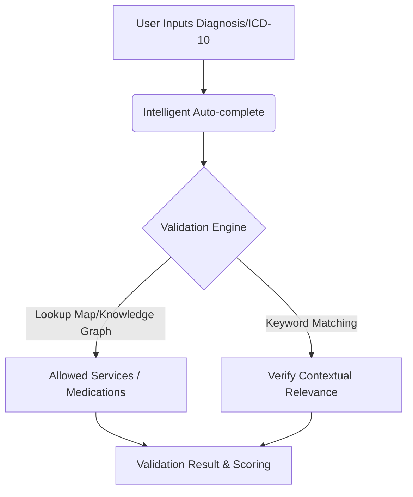
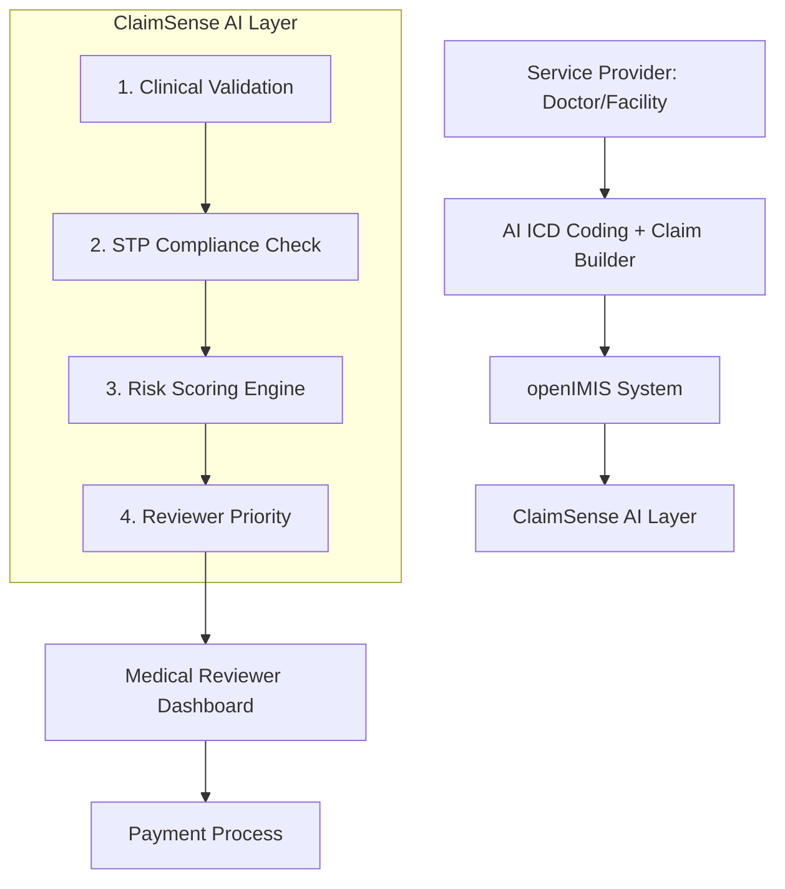
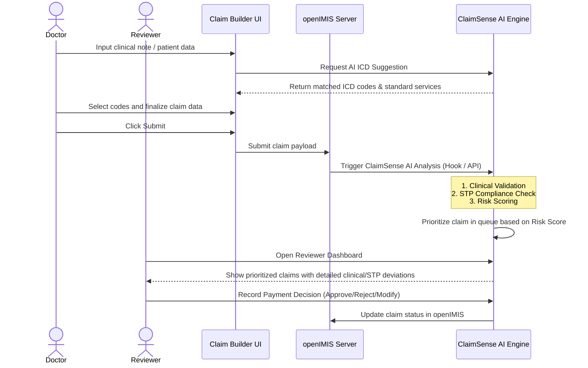

# Hackathon Track Study: Clinical Compliance & Standards Core

This document outlines the conceptual breakdown, data standards, architectural strategies, and implementation options for the **ClaimSenseAI** project under the **Clinical Compliance & Standards Core** track.

---

## 1. Track Overview & Objectives

The track is divided into two primary clinical validation pillars:
1. **Intelligent ICD-to-Service Mapping**: An autocomplete and validation module that cross-references diagnosis codes (ICD) with treatments, drugs, and services to catch billing and clinical errors before submission.
2. **Real-Time STP Compliance Checker**: A rule-based engine that compares care pathways (encounters, diagnostic tests, treatments) against Standard Treatment Protocols (STPs) to score clinical quality, identify deviations, and verify claim legitimacy.

---

## 2. Component 1: Intelligent ICD-to-Service Mapping

### A. The Challenge
Medical claims often contain mismatches where the billed service or prescribed drug does not align with the patient’s diagnosed condition (e.g., billing for an appendectomy when the diagnosis is acute tonsillitis, or prescribing an antihypertensive for a fracture). 

### B. Standard Vocabularies & Ontologies
To build an effective mapper, we must reference standardized systems:
*   **Diagnoses**: **ICD-10-CM** (Clinical Modification) or **ICD-11**.
*   **Medications**: **RxNorm** (US) or **ATC (Anatomical Therapeutic Chemical)** classification system.
*   **Procedures & Billed Services**: **CPT** (Current Procedural Terminology), **HCPCS** Level II, or **SNOMED-CT**.

### C. Technical Approaches for Mapping



1. **Rule-Based Mapping (Knowledge Graph / Relational Mapping)**:
   *   **Mechanism**: A predefined relational database or JSON mapping of ICD codes to eligible CPT codes and RxNorm ingredients.
   *   **Pros**: Deterministic, fast, 100% auditable.
   *   **Cons**: High maintenance; hard to cover all medical edge cases manually.
2. **Fuzzy Keyword Matching (Local Search)**:
   *   **Mechanism**: Tokenize input text, clean stop words, and perform fuzzy keyword matching (using a library like `fuse.js` or basic string similarity metrics) against a structured local dictionary of ICD-10 titles and clinical synonyms.
   *   **Pros**: Deterministic, fast, 100% offline-capable, easy to customize for specific conditions.
   *   **Cons**: Relies on dictionary synonyms coverage.
3. **Keyword-to-Rule Engine Matching (Recommended)**:
   *   Use **fuzzy keyword search** for the autocomplete UI to help providers select the right codes quickly.
   *   Use a **rule-based validation engine** for the hard clinical restrictions (e.g., checking if medications, services, and procedures are compatible with the selected ICD code).

---

## 3. Component 2: Real-Time STP Compliance Checker

### A. The Challenge
A patient's care pathway consists of a series of actions over time: symptoms presentation $\rightarrow$ diagnostic tests $\rightarrow$ confirmed diagnosis $\rightarrow$ therapeutics/surgical intervention $\rightarrow$ follow-up. 
Standard Treatment Protocols (STPs) dictate the guidelines for these pathways. A compliance checker must evaluate this sequence in real-time.

### B. Modeling Care Pathways
A clinical pathway can be modeled using standard data formats:
*   **FHIR (Fast Healthcare Interoperability Resources)**: Utilizing `Condition`, `Observation`, `Procedure`, `MedicationRequest`, and `CarePlan` resources.
*   **Sequential Log / Graph**: A chronological array of events:
    ```json
    [
      { "timestamp": "2026-06-16T10:00:00Z", "type": "symptom", "value": "High Fever & Chills" },
      { "timestamp": "2026-06-16T10:15:00Z", "type": "test_ordered", "value": "Malaria RDT" },
      { "timestamp": "2026-06-16T10:45:00Z", "type": "test_result", "value": "P. falciparum Positive" },
      { "timestamp": "2026-06-16T11:00:00Z", "type": "prescription", "value": "Artemether-Lumefantrine" }
    ]
    ```

### C. Rule Engine Architecture
To check compliance dynamically, we need an engine to evaluate declarative rules.
*   **Rule Representation**: Rules can be written in JSON for portability:
    ```json
    {
      "protocol": "Malaria Treatment Protocol",
      "conditions": {
        "all": [
          { "fact": "diagnosis", "operator": "equal", "value": "Malaria" },
          { "fact": "diagnostic_test_performed", "operator": "equal", "value": true }
        ]
      },
      "event": {
        "type": "compliant",
        "params": { "message": "Standard diagnostic confirmation met before treatment." }
      }
    }
    ```
*   **Rule Engine Options**:
    *   **Node.js**: `json-rules-engine` (fast, declarative, runs on client or server).
    *   **Python**: `durable-rules` or simple custom AST evaluation.
    *   **Graph/State Machine**: Model protocols as a State Machine (e.g., using `XState` in TypeScript) where transitions represent allowed clinical steps. Deviations are triggered when invalid transitions are attempted.

### D. Scoring Methodology
The compliance checker should output a **Care Legitimacy Score** (e.g., 0 - 100).
*   **Formula Component**:
    $$\text{Legitimacy Score} = 100 - \sum (\text{Deviation Penalty} \times \text{Weight})$$
*   **Deviation Categories**:
    *   *Critical Deviation* (Weight: 40): Missing mandatory diagnostics (e.g., treating malaria without a positive test), prescribing contraindicated drugs.
    *   *Major Deviation* (Weight: 20): Sub-therapeutic dosage, incorrect sequencing (e.g., performing MRI before X-ray for standard joint pain).
    *   *Minor Deviation* (Weight: 5): Delayed administration, lack of routine follow-up checkups.

---

## 4. Tech Stack for ClaimSenseAI

We have finalized the tech stack as **Option A (Next.js Fullstack)** using JavaScript.

| Layer | Selected Tech | Rationale |
| :--- | :--- | :--- |
| **Frontend Framework** | React 19 (Next.js App Router) | Fast page loads, server component optimization, and seamless page routing. |
| **Styling & Icons** | Tailwind CSS v4 & Lucide React | High-fidelity UI with glassmorphic designs, dark mode capabilities, and consistent icons. |
| **Data Visualization** | Recharts & SVG timelines | To render responsive patient care pathway flowcharts and identify deviation points. |
| **Backend API** | Next.js API Routes (Serverless) | Keeps frontend and backend consolidated in a single codebase with unified routing. |
| **AI / NLP Services** | Fuse.js & Keyword Search | Local fuzzy index (Fuse.js) for fast autocomplete search and clinical note keyword matching. |
| **Database** | SQLite or Local JSON Storage | Simple, lightweight database to store claims, reviewer logs, and rule metrics. |
| **Rule Engine** | JavaScript Objects / JSON Engine | Native JS modules or `json-rules-engine` package to evaluate standard treatment protocols. |


---

## 5. Next Steps for Implementation

Now that our project scaffolding, tech stack, schemas, and clinical protocols are finalized, the developers can begin building the following features in parallel:

*   **For Developer 1 (Provider UI)**: 
    1. Create the claim builder UI layout (`src/app/doctor/page.jsx`).
    2. Write the client-side claim state manager (compiling structured claims).
    3. Mock the local openIMIS submission route (`src/app/api/openimis/route.js`).
*   **For Developer 2 (AI Engine)**:
    1. Implement the local dictionary JSON file (`src/lib/clinicalDictionary.json`) containing our 10 clinical protocols.
    2. Write the fuzzy keyword autocomplete suggestions logic (`src/lib/icdSuggester.js`).
    3. Write the rule evaluator (`src/lib/stpEngine.js`) validating pathways and calculating scores.
*   **For Developer 3 (Reviewer Queue)**:
    1. Build the list queue layout showing claims sorted by priority (`src/app/reviewer/page.jsx`).
    2. Build the review detailed panel displaying deviation visual timelines.
    3. Expose the adjudication route (`src/app/api/adjudicate/route.js`).

---

## 6. System Architecture & Integration

Based on your system plan, the claim lifecycle flows as follows:



### Key Architectural Integrations
1. **openIMIS Integration**: 
   * openIMIS is an open-source Insurance Management Information System. We will need to interface with openIMIS claim data structures (either via webhooks, REST APIs, or database triggers).
2. **ClaimSense AI Layer Functions**:
   * **Clinical Validation**: ICD-to-service mapping and dosage/contraindication checks.
   * **STP Compliance Check**: Evaluating sequence of care against national Standard Treatment Protocols.
   * **Risk Scoring Engine**: Assessing probability of fraud, waste, or abuse (FWA) based on clinical and billing patterns.
   * **Reviewer Priority**: Routing high-risk or high-deviation claims to the top of the Medical Reviewer's queue to optimize manual review time.
3. **Medical Reviewer Dashboard**:
   * A targeted workspace for claim reviewers showing validation details, highlighted STP deviations, risk scores, and reasons for prioritization.

---

## 7. End-to-End Claim Workflow

Here is the sequential user and data workflow that we will implement:



### Detailed Steps:
1. **Doctor Note Input**: The doctor inputs structured and/or unstructured notes about the patient's presentation.
2. **AI ICD Suggestion**: The system parses the note (or uses structured inputs) to suggest appropriate ICD codes and clinical services.
3. **Claim Builder**: The provider completes the claim details, confirming the proposed diagnoses, medications, procedures, and costs.
4. **Submit to openIMIS**: The claim is sent to openIMIS.
5. **ClaimSense AI Analysis**: The submission triggers analysis by our ClaimSense AI engine.
6. **Clinical Validation**: Verifies code/service compatibility, drug dosages, and contraindications.
7. **STP Compliance Check**: Checks clinical actions against guidelines, scoring the clinical care quality.
8. **Risk Scoring**: Evaluates the probability of claims anomalies or non-compliance.
9. **Reviewer Dashboard**: A dashboard that displays flags, clinical graphs, deviations, and prioritization scores.
10. **Payment Decision**: The reviewer adjudicates the claim, syncing the status back.

---

## 8. Finalized Hackathon Scope Decisions

Based on alignment, we have finalized the following scoping decisions:
*   **openIMIS Integration**: We will use a **Mock/Simulated openIMIS API** approach. This will involve exposing API endpoints (e.g., webhook receiver) that mirror realistic openIMIS schemas.
*   **Clinical Conditions**: We will focus on **10 clinical conditions** to model rules and protocols for (e.g., Malaria, Hypertension, Diabetes, Appendicitis, Tuberculosis, Anemia, Tonsillitis, Asthma, Cholecystitis, UTI).
*   **AI ICD Suggestion**: We will use a **rule-based / keyword search engine** (fast, offline-capable, and deterministic) that parses clinical notes and matches them against our clinical dictionary.

---

## 9. Team Collaboration & Git Branching Strategy

To match our team structure (3 active developers and 1 documenter), we will maintain exactly **three main Git branches** to streamline development, testing, and deployment:

1.  **`main`** (Stable / Demo Version):
    *   This is the presentation-ready production code. It must remain fully functional at all times. 
    *   Only code that has been thoroughly tested and signed off in `qa` is merged into `main`.
2.  **`qa`** (Quality Assurance & Integration Staging):
    *   This branch acts as our integration gate. 
    *   When the developers finish individual features and merge them into `dev`, those changes are promoted to `qa` to verify that the clinical validation rules, frontend interface, and mock openIMIS database run seamlessly together.
3.  **`dev`** (Active Development Collaboration):
    *   This is the shared playground for our 3 developers. 
    *   Instead of working in isolated silos, the 3 developers pull from `dev` and push their incremental additions to `dev` frequently. This ensures early integration and immediate visibility of API or component contract changes.

---

## 10. Core Application Modules

We will implement the following 9 modules as defined in the system specification:

### 🟦 Module 1: ICD Knowledge Engine
*   **Purpose**: Provide standardized disease coding mappings.
*   **Data Source**: World Health Organization (WHO) ICD-11 API.
*   **Process**: WHO ICD API $\rightarrow$ Local Database $\rightarrow$ Search Index.
*   **Stored Structure**:
    ```json
    {
      "code": "J18.9",
      "title": "Pneumonia",
      "synonyms": ["lung infection", "fever cough"]
    }
    ```

### 🟦 Module 2: AI Clinical Note Interpreter
*   **Purpose**: Convert unstructured doctor text into structured clinical meaning.
*   **Input**: `“Fever, cough, difficulty breathing”`
*   **Process**: Rule-based keyword extraction (regex / symptom dictionary matching).
*   **Output**:
    ```json
    {
      "symptoms": ["fever", "cough", "breathlessness"],
      "suspected_diagnosis": "pneumonia"
    }
    ```

### 🟦 Module 3: AI ICD Coding Engine
*   **Purpose**: Suggest appropriate ICD codes based on clinical notes.
*   **Process**: Text $\rightarrow$ Tokenize and clean $\rightarrow$ Fuzzy match tokens against local clinical dictionary $\rightarrow$ Return top 3 matched ICD codes based on keyword density.
*   **Output**:
    ```json
    [
      { "code": "J18.9", "confidence": 0.94 },
      { "code": "J00", "confidence": 0.40 }
    ]
    ```

### 🟦 Module 4: Claim Builder (Provider Side)
*   **Purpose**: Assist doctors in constructing a structured, valid claim payload.
*   **Input**: Selected ICD code, prescribed medicines, services, and CPT procedures.
*   **Output**:
    ```json
    {
      "icd": "J18.9",
      "services": ["Chest X-Ray", "CBC"],
      "medicines": ["Amoxicillin"]
    }
    ```

### 🟦 Module 5: Clinical Validation Engine (Core Innovation)
*   **Purpose**: Detect and flag clinical mismatches during claim compilation.
*   **Validation Checks**:
    1. *Diagnosis ↔ Service*: e.g., Pneumonia + MRI Brain ❌
    2. *Diagnosis ↔ Medication*: e.g., Diabetes + Antibiotic ❌
    3. *Diagnosis ↔ Procedure*: e.g., Cold + CT Scan ❌
*   **Output**:
    ```json
    {
      "issues": ["MRI Brain not clinically justified"],
      "status": "warning"
    }
    ```

### 🟦 Module 6: STP Compliance Engine
*   **Purpose**: Evaluate the care pathway against national Standard Treatment Protocols (STPs).
*   **Evaluation Example**:
    - *Expected*: Acute Diarrhea $\rightarrow$ ORS + Zinc
    - *Actual*: CT Scan + IV Antibiotics
*   **Output**:
    ```json
    {
      "compliance_score": 38,
      "deviation": "High"
    }
    ```

### 🟦 Module 7: Risk Scoring Engine
*   **Purpose**: Quantify the overall claim risk score using a weighted multi-factor calculation.
*   **Risk Factors & Weights**:
    - **ICD Accuracy**: 25%
    - **Clinical Match (Diagnosis ↔ Services/Meds)**: 30%
    - **STP Compliance**: 30%
    - **Anomaly Detection**: 15%
*   **Output**:
    ```json
    {
      "risk_score": 87,
      "risk_level": "HIGH"
    }
    ```

### 🟦 Module 8: Reviewer Prioritization Engine
*   **Purpose**: Sort and prioritize claims dynamically for the insurance review queue.
*   **Function**: Sort claims by Risk Score descending (highest risk first).
*   **Example Queue**:
    | Claim ID | Risk Score |
    | :--- | :--- |
    | `C001` | 92 (High Priority) |
    | `C003` | 78 (Medium-High Priority) |
    | `C002` | 45 (Low Priority) |

### 🟦 Module 9: Dashboard (Very Important)
*   **Provider View**:
    - Enter unstructured clinical notes.
    - View instant AI ICD suggestions.
    - Interactively build the claim checklist.
    - Review warnings and compliance scores in real-time.
*   **Reviewer View**:
    - Claims list sorted dynamically by risk.
    - Interactive panels highlighting clinical mismatches and STP deviation pathways.
    - Direct Approve/Reject interface.


